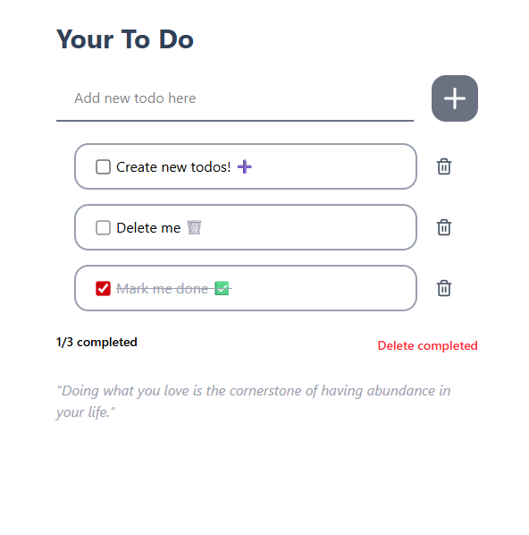

# Minimal React Todo App

A simple **Todo App** built with **React**, **TypeScript**, **Tailwind CSS**, and **Lucide React** icons.  
It syncs todos to **localStorage** so your tasks stay even after refreshing.

---

## 🚀 Features

- ✅ Add, complete, and delete tasks
- 💾 Auto-sync to browser **localStorage**
- 🎨 Styled with **Tailwind CSS** for a clean UI
- 🖼️ **Lucide React** for beautiful icons
- ⚡ Built with **TypeScript** for type safety

---

## 🖼️ Screenshot

<!-- Add screenshot here -->



---

## 🛠️ Tech Stack

- **React** (Frontend)
- **TypeScript** (Type Safety)
- **Tailwind CSS** (Styling)
- **Lucide React** (Icons)

---

## 📦 Installation & Setup

```bash
# Clone the repository
git clone https://github.com/yourusername/todo-app.git
cd todo-app

# Install dependencies
pnpm install

# Run the development server
pnpm dev
```
